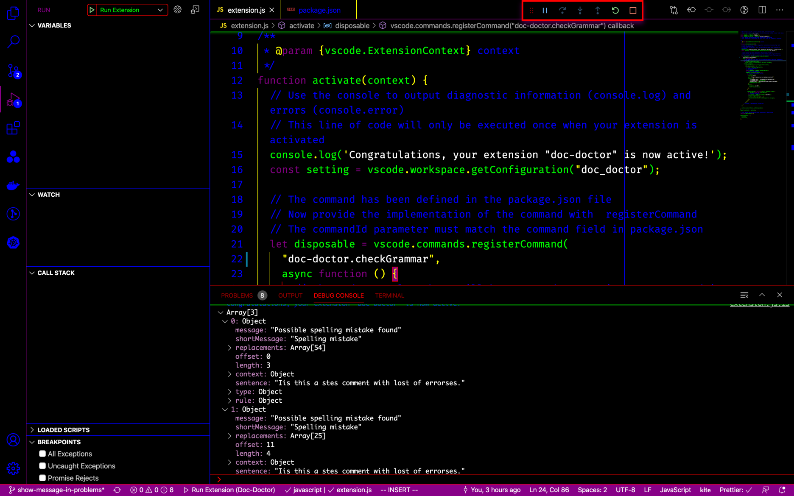

# Doc Doctor

Docstring grammar checks

## Features

### Grammar check

Checking grammar of the docstring.

## Install

### API key

1. Go to <https://www.grammarbot.io/>, register an account.
1. Save the api key to settings.json for doc_doctor.key

## Usage

When installed, open command pallet, then select "Hello World"
